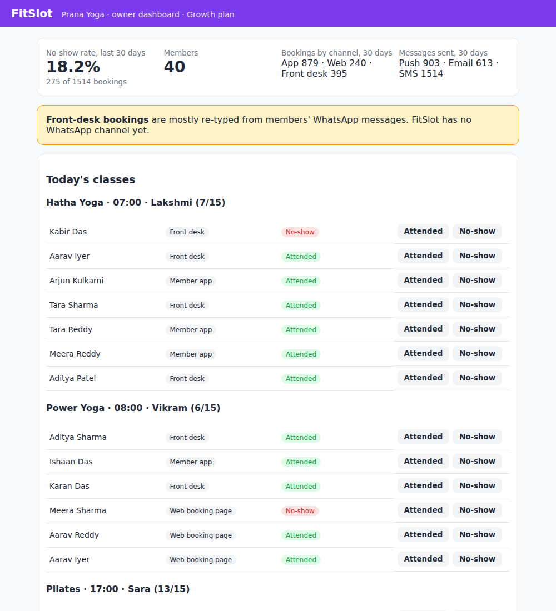

# FitSlot (demo app)

A minimal version of **FitSlot**, the fictional booking and membership app for small fitness studios in India. It exists to be the "product" that the Feature Research Agent researches: the demo shows it, and the Effort Estimator reads this codebase to size the WhatsApp feature.

All data is generated sample data.



## Stack

| Layer | Choice | Why |
|---|---|---|
| Framework | **Next.js 16** (App Router, Server Components, Server Actions) | One TypeScript codebase for pages and API; deploys to Vercel for free |
| Language | **TypeScript** (strict) | Types flow from the database to the UI |
| Database | **SQLite** via **Prisma 7** (`better-sqlite3` driver adapter) | Zero setup locally; switch the provider to Postgres for production |
| Tests | **Vitest** | Fast, runs the booking rules, reminders, webhook and API against a throwaway SQLite file |

## Run it

Needs Node 20.9 or later.

```bash
npm install          # also generates the Prisma client
cp .env.example .env
npm run db:push      # create dev.db from prisma/schema.prisma
npm run seed         # 2 studios, 80 members, 30 days of history, 7 days ahead
npm run dev
```

Open http://localhost:3000 and pick a studio's **owner dashboard** or a **member view**.

```bash
npm test             # 8 tests
npm run typecheck && npm run lint
npm run reminders    # send reminders for classes in the next 2 hours (run from cron every 5 min)
```

## What's in it

| Path | What it does |
|---|---|
| `prisma/schema.prisma` | Studio (Starter / Growth / Pro plan), Member (per-channel consent flags), ClassType, ClassSession, Booking, WaitlistEntry, Notification log, PaymentEvent |
| `src/lib/billing.ts` | Plan limits and feature gating: `hasFeature`, `PLAN_FEATURES` |
| `src/lib/bookings.ts` | Book, cancel (2-hour cutoff), waitlist promotion, attendance |
| `src/lib/notifications/channels.ts` | Channel interface with Push, Email and SMS (stubbed providers) and `notify()` |
| `src/lib/notifications/reminders.ts` | Reminder job: SMS + push 2 hours before class |
| `src/lib/webhooks.ts` | HMAC signature check for inbound webhooks |
| `src/app/m/[memberId]/` | Member booking page (Server Actions for book / cancel) |
| `src/app/studio/[studioId]/` | Owner dashboard: no-show rate, bookings by channel, messages sent, today's classes with attendance |
| `src/app/api/bookings/…` | JSON API used by the member app |
| `src/app/api/webhooks/payments/` | Payment gateway webhook: signature check, idempotent event store |
| `src/app/api/cron/reminders/` | Reminder job over HTTP for a hosted scheduler (e.g. Vercel Cron) |
| `scripts/seed.ts` | Deterministic demo data |

## What the demo data shows

The seed is built to match the pain points in the FitSlot product profile:

- **No-show rate of about 18%** on the owner dashboard.
- **About a quarter of bookings come from the front desk**, typed in by staff from members' WhatsApp messages.
- **SMS reminders go out on Growth and Pro only**, gated through `hasFeature`.

## Where WhatsApp would plug in

These are the integration points the Effort Estimator should find:

1. `src/lib/notifications/channels.ts`: add a `whatsapp` channel and register it in `CHANNELS`.
2. `src/lib/notifications/reminders.ts`: send reminders on `["whatsapp", "push"]` when the studio has the feature.
3. `src/lib/billing.ts`: add `"whatsapp"` to `Feature` and `PLAN_FEATURES` for the chosen tier.
4. `prisma/schema.prisma`: add a `whatsappOptIn` consent flag to `Member` (opt-in is required).
5. `src/lib/bookings.ts`: a WhatsApp bot calls the same `book()` / `cancel()`, with a new booking source.
6. `src/app/api/webhooks/`: copy the signed, idempotent webhook pattern for inbound WhatsApp messages.

## Deliberately left out

Real authentication, real SMS / push / email providers, payments beyond the webhook, and multi-location. It's a demo, not production code.
